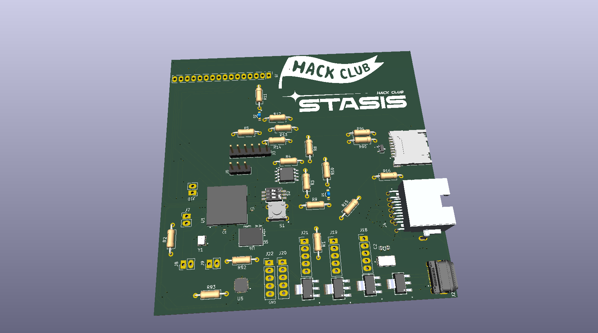

# FPL
FPL is a FPGA based board that runs linux and provides many digital interfaces.
# WHY
I have always wanted to have a benchtop device that can probe I2C,SPI and uart devices all ath the same time. In addition, I have always wanted to mess around with and use an FPGA.
# PCB

# BOM
